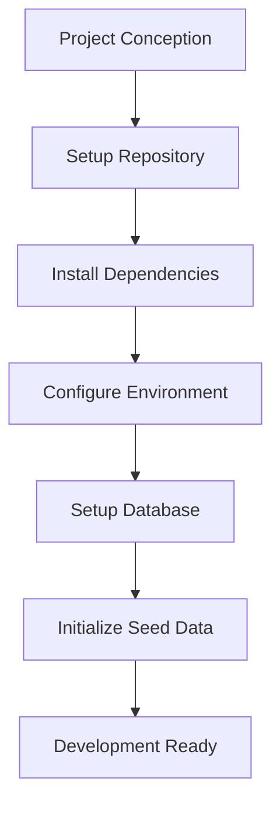
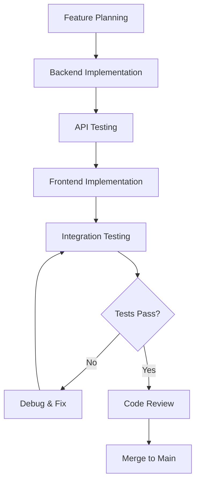
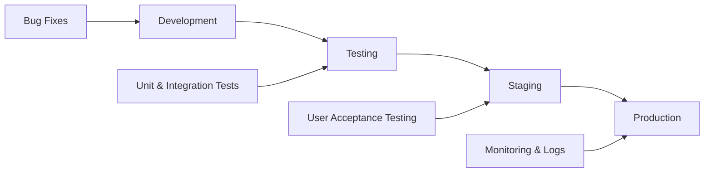
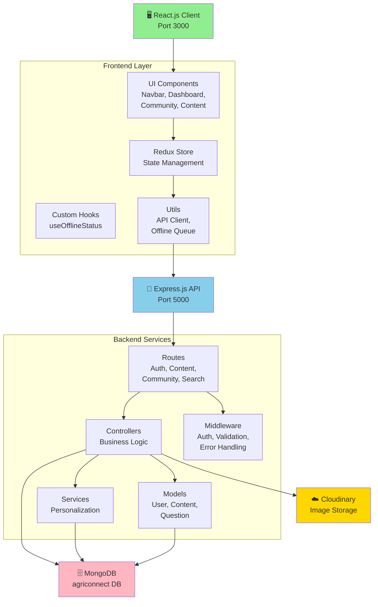
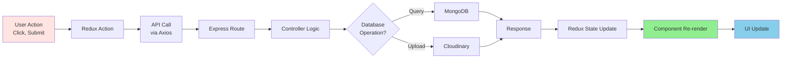
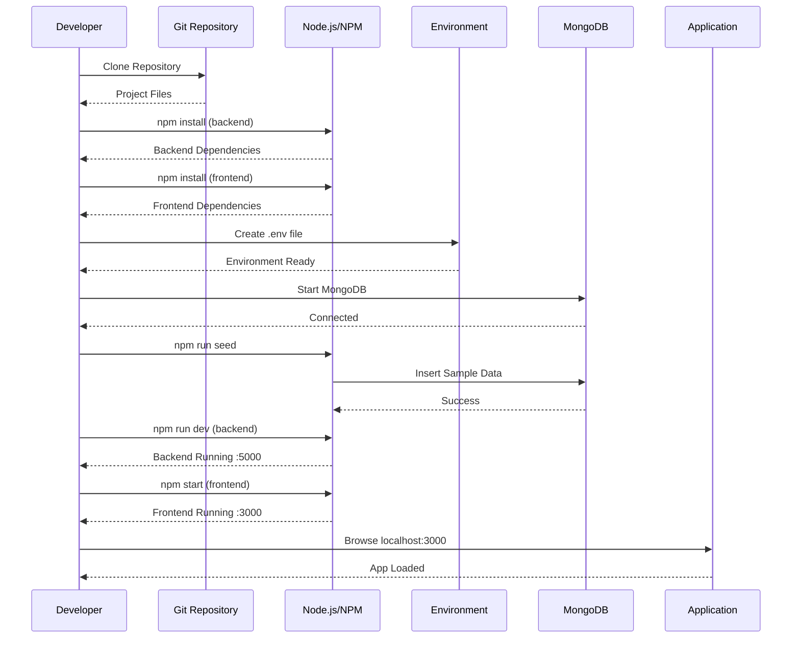
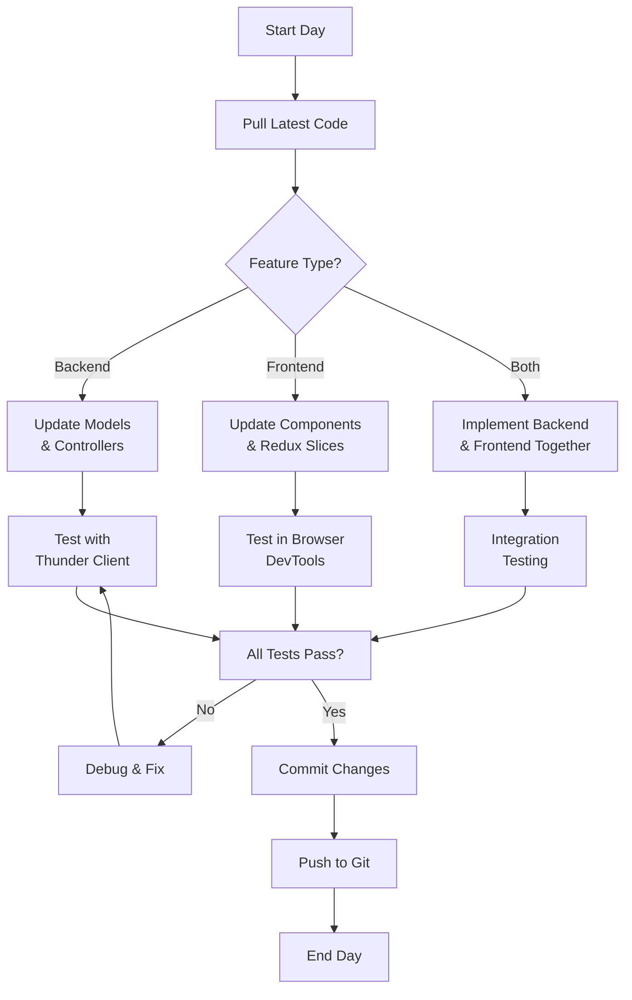
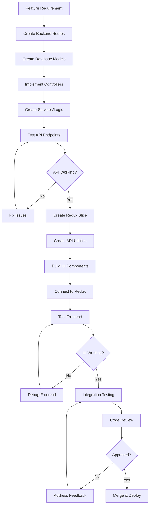
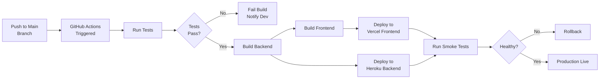
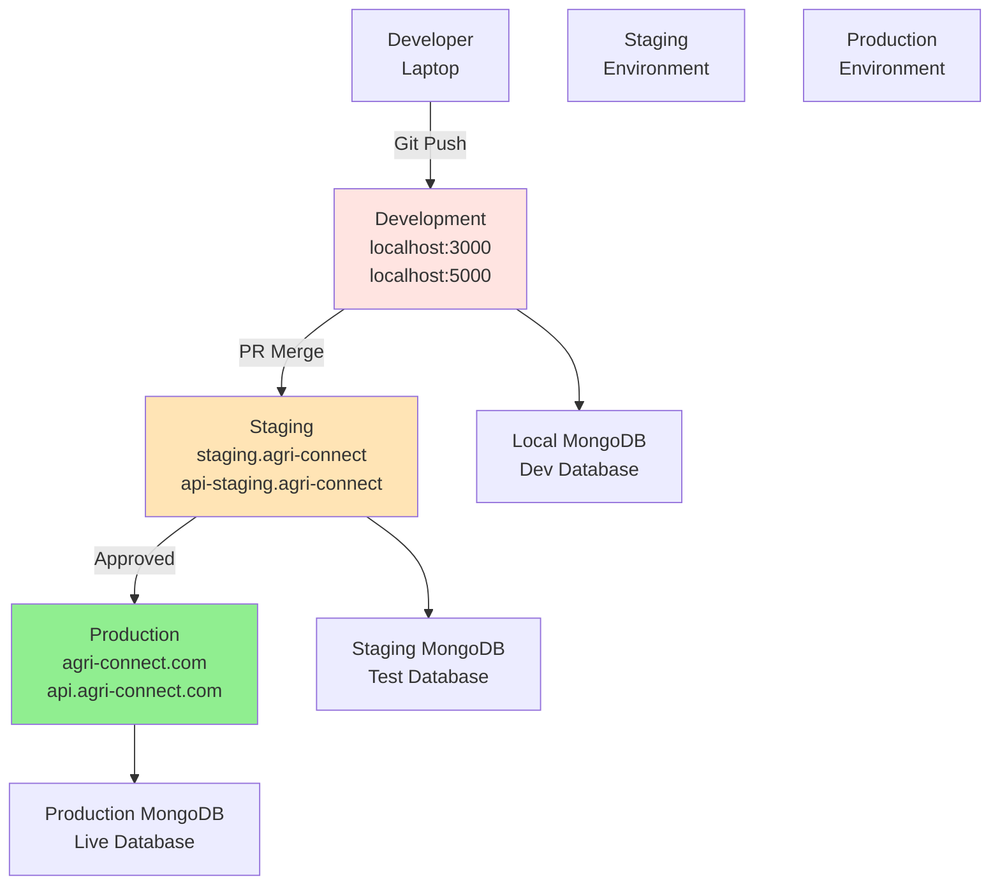

# Agri-Connect: Project Lifecycle Documentation

## Table of Contents
1. [Project Overview](#project-overview)
2. [Development Lifecycle](#development-lifecycle)
3. [Architecture](#architecture)
4. [Setup & Initialization](#setup--initialization)
5. [Development Workflow](#development-workflow)
6. [Deployment Pipeline](#deployment-pipeline)
7. [Research Notes](#research-notes)

---

## Project Overview

**Agri-Connect** is a comprehensive agricultural technology platform designed to connect farmers with expert knowledge, community support, and personalized content recommendations.

### Key Features
- 🔐 **Authentication System**: JWT-based auth with refresh tokens
- 📚 **Content Management**: Articles and educational resources
- 👥 **Community Forum**: Q&A platform for farmer engagement
- 🔍 **Search**: Full-text search capabilities
- 📊 **Dashboard**: Personalized farmer dashboard
- 🛡️ **Admin Panel**: Content and user management
- 📱 **Progressive Web App (PWA)**: Offline-first architecture
- 🌐 **Multi-role Support**: Farmer, Expert, Extension Officer, Admin roles

### Tech Stack

#### Backend
```
Node.js + Express.js
├── Database: MongoDB
├── Authentication: JWT (jsonwebtoken)
├── Validation: express-validator
├── Security: Helmet, CORS, Rate Limiting
├── File Upload: Cloudinary
└── Logging: Morgan
```

#### Frontend
```
React.js 18 + Redux Toolkit
├── Routing: React Router v6
├── Styling: Tailwind CSS
├── HTTP Client: Axios
├── State Management: Redux Toolkit
└── PWA Features: Service Workers
```

---

## Development Lifecycle

### Phase 1: Project Initialization


### Phase 2: Feature Development Cycle


### Phase 3: Full Development Lifecycle


---

## Architecture

### System Architecture Diagram


### Data Flow Diagram


---

## Setup & Initialization

### Complete Setup Sequence


---

## Development Workflow

### Daily Development Process


### Feature Implementation Flow


---

## Deployment Pipeline

### CI/CD Deployment Flow


### Multi-Environment Setup


---

## Research Notes

### Project Metrics

| Metric | Value |
|--------|-------|
| **Total Routes** | 6 main route groups (auth, users, content, community, search, admin) |
| **Database Models** | 3 (User, Content, Question) |
| **Frontend Components** | 15+ reusable components |
| **Redux Slices** | 2 (auth, content) |
| **API Endpoints** | 20+ endpoints across all route groups |
| **Middleware Layers** | 3 (auth, error handling, validation) |
| **Security Features** | JWT, Helmet, CORS, Rate Limiting, bcrypt |

### Key Dependencies

#### Backend Dependencies
- **express**: Web server framework
- **mongoose**: MongoDB ODM
- **jsonwebtoken**: JWT authentication
- **bcryptjs**: Password hashing
- **express-validator**: Request validation
- **cors**: Cross-Origin Resource Sharing
- **helmet**: Security headers
- **multer**: File uploads
- **cloudinary**: Image storage service

#### Frontend Dependencies
- **react**: UI library
- **react-redux**: State management binding
- **react-router-dom**: Client-side routing
- **axios**: HTTP client
- **tailwindcss**: Utility-first CSS
- **@reduxjs/toolkit**: Redux modern approach

### Performance Considerations

1. **Database Optimization**
   - Index on frequently queried fields (userId, contentId)
   - Pagination for large datasets
   - Lean queries for read-only operations

2. **Frontend Optimization**
   - Code splitting with React.lazy
   - Image optimization via Cloudinary
   - Service Worker for offline caching
   - Redux selectors to prevent unnecessary re-renders

3. **Security Hardening**
   - Rate limiting on auth endpoints
   - Helmet.js for security headers
   - Input validation on all endpoints
   - JWT token rotation

### Scalability Roadmap

1. **Phase 1** (Current): Monolithic architecture
2. **Phase 2**: Microservices (Content, Community, Search services)
3. **Phase 3**: GraphQL API for flexible queries
4. **Phase 4**: Real-time features (WebSockets for notifications)
5. **Phase 5**: Mobile native apps (React Native)

---

## Version History

- **v1.0.0** - Initial release with core features
- **Features Completed**: Auth, Dashboard, Content, Community, Search, Admin, PWA

---

*Documentation created for research and development reference purposes.*
*Last updated: 2026-06-19*
