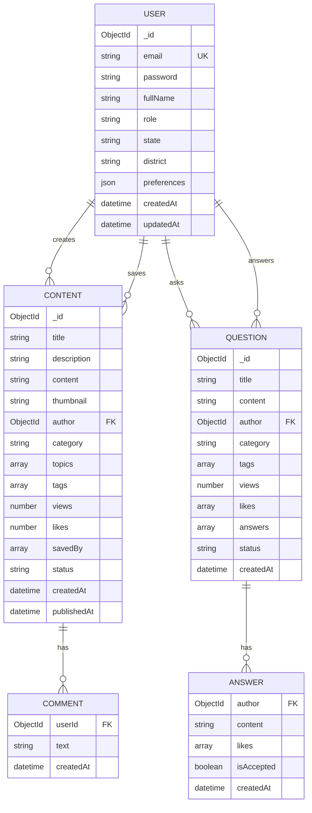
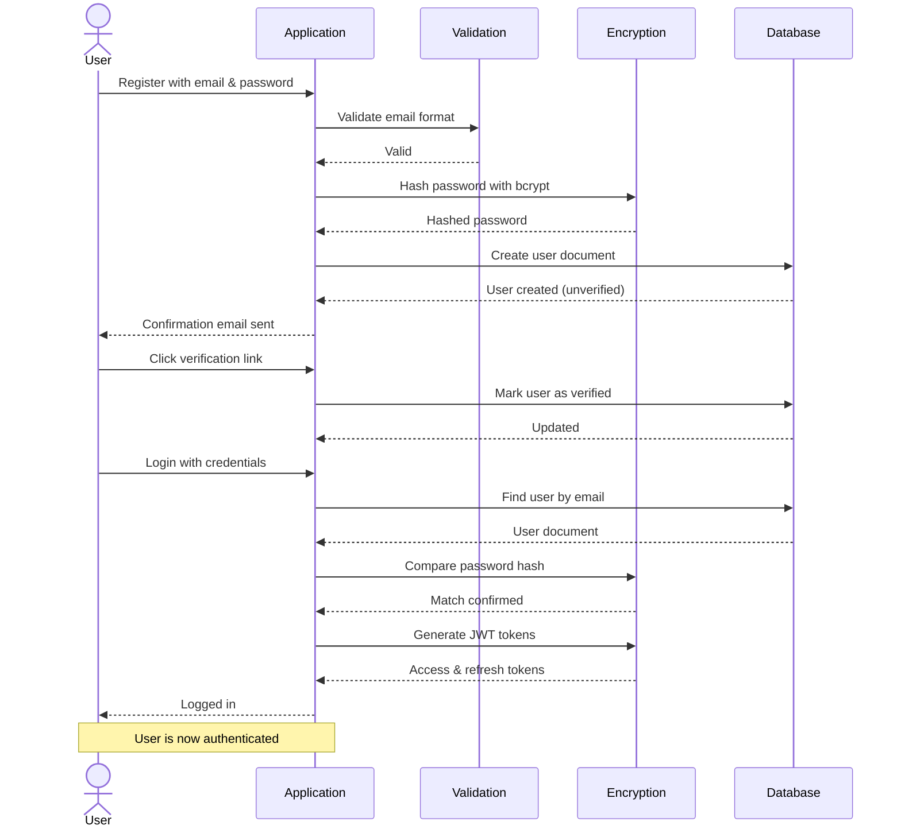
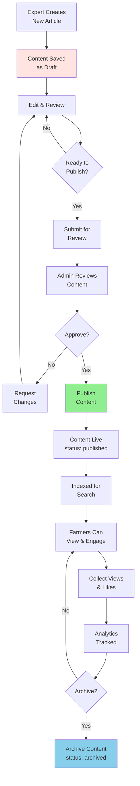
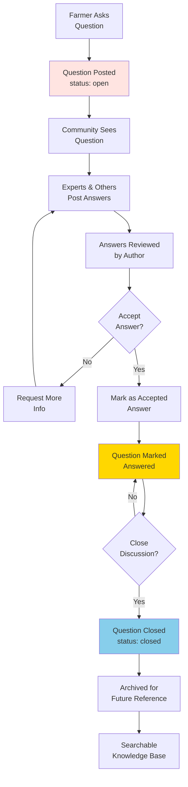
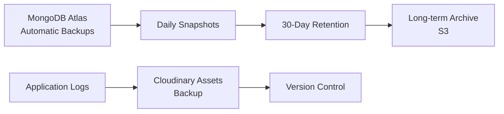

# Database Schema & Data Lifecycle

## Overview

Agri-Connect uses **MongoDB** as its NoSQL database with three primary models: `User`, `Content`, and `Question`. This document outlines the data structure, relationships, and lifecycle of data through the system.

---

## Data Models

### User Model

Represents farmer, expert, extension officer, or admin users.

```javascript
{
  _id: ObjectId,
  
  // Authentication
  email: String (unique, required),
  password: String (hashed with bcrypt),
  refreshTokens: [String],
  
  // Profile Information
  fullName: String,
  role: String (enum: ["farmer", "expert", "extension", "admin"]),
  state: String,
  district: String,
  region: String,
  
  // Settings
  preferences: {
    language: String,
    contentTopics: [String],
    notifications: Boolean,
  },
  
  // Metadata
  createdAt: Date,
  updatedAt: Date,
  lastLogin: Date,
  isVerified: Boolean,
}
```

### Content Model

Represents educational articles and resources.

```javascript
{
  _id: ObjectId,
  
  // Core Content
  title: String (required),
  description: String,
  content: String (HTML/Markdown),
  thumbnail: String (Cloudinary URL),
  
  // Metadata
  author: ObjectId (ref: User),
  category: String (enum: ["crop", "livestock", "soil", "weather", ...]),
  topics: [String],
  tags: [String],
  
  // Engagement
  views: Number,
  likes: Number,
  savedBy: [ObjectId] (ref: User),
  comments: [{
    userId: ObjectId,
    text: String,
    createdAt: Date,
  }],
  
  // SEO & Indexing
  slug: String (unique),
  metaDescription: String,
  
  // Status
  status: String (enum: ["draft", "published", "archived"]),
  createdAt: Date,
  updatedAt: Date,
  publishedAt: Date,
}
```

### Question Model

Represents community Q&A forum posts.

```javascript
{
  _id: ObjectId,
  
  // Core Question
  title: String (required),
  description: String,
  content: String,
  
  // Author
  author: ObjectId (ref: User),
  
  // Classification
  category: String (enum: ["crop", "livestock", "soil", ...]),
  tags: [String],
  
  // Engagement
  views: Number,
  likes: [ObjectId] (ref: User),
  
  // Answers
  answers: [{
    _id: ObjectId,
    author: ObjectId (ref: User),
    content: String,
    likes: [ObjectId],
    isAccepted: Boolean,
    createdAt: Date,
    updatedAt: Date,
  }],
  
  // Status
  status: String (enum: ["open", "answered", "closed"]),
  createdAt: Date,
  updatedAt: Date,
}
```

---

## Data Relationships

### Entity Relationship Diagram



---

## Data Lifecycle

### User Data Lifecycle



### Content Creation & Publication Lifecycle



### Question & Answer Lifecycle



---

## Data Aggregation Pipeline Examples

### Get User Dashboard Stats

```javascript
db.content.aggregate([
  {
    $match: { author: userId }
  },
  {
    $group: {
      _id: "$category",
      totalViews: { $sum: "$views" },
      totalLikes: { $sum: "$likes" },
      count: { $sum: 1 }
    }
  },
  {
    $sort: { totalViews: -1 }
  }
])
```

### Get Top Questions

```javascript
db.question.aggregate([
  {
    $addFields: {
      answerCount: { $size: "$answers" }
    }
  },
  {
    $match: {
      answerCount: { $gt: 0 },
      status: "answered"
    }
  },
  {
    $sort: { views: -1 }
  },
  {
    $limit: 10
  }
])
```

### Get Trending Topics

```javascript
db.content.aggregate([
  {
    $unwind: "$tags"
  },
  {
    $group: {
      _id: "$tags",
      count: { $sum: 1 },
      avgViews: { $avg: "$views" }
    }
  },
  {
    $sort: { avgViews: -1 }
  },
  {
    $limit: 5
  }
])
```

---

## Indexing Strategy

### Recommended Indexes

```javascript
// User indexes
db.user.createIndex({ email: 1 }, { unique: true });
db.user.createIndex({ role: 1 });
db.user.createIndex({ createdAt: -1 });

// Content indexes
db.content.createIndex({ author: 1 });
db.content.createIndex({ category: 1 });
db.content.createIndex({ status: 1 });
db.content.createIndex({ slug: 1 }, { unique: true });
db.content.createIndex({ title: "text", description: "text" });
db.content.createIndex({ createdAt: -1 });

// Question indexes
db.question.createIndex({ author: 1 });
db.question.createIndex({ category: 1 });
db.question.createIndex({ status: 1 });
db.question.createIndex({ title: "text", content: "text" });
db.question.createIndex({ createdAt: -1 });

// Array field indexes
db.content.createIndex({ "savedBy": 1 });
db.question.createIndex({ "likes": 1 });
```

---

## Data Backup & Retention

### Backup Strategy



### Data Retention Policy

| Data Type | Retention | Action |
|-----------|-----------|--------|
| **Active User Data** | Indefinite | Keep unless user requests deletion |
| **Archived Content** | 1 year | After review, move to cold storage |
| **Deleted User Data** | 30 days | Soft delete, then hard delete |
| **Logs & Analytics** | 90 days | Archive to S3 |
| **Session Tokens** | 7 days (refresh) | Auto-rotate |

---

## Data Validation Rules

### User Validation

```javascript
{
  email: {
    required: true,
    format: "email",
    unique: true
  },
  password: {
    required: true,
    minLength: 8,
    patterns: ["uppercase", "lowercase", "number", "special"]
  },
  fullName: {
    required: true,
    minLength: 2,
    maxLength: 100
  },
  role: {
    enum: ["farmer", "expert", "extension", "admin"]
  }
}
```

### Content Validation

```javascript
{
  title: {
    required: true,
    minLength: 5,
    maxLength: 200
  },
  content: {
    required: true,
    minLength: 100
  },
  category: {
    required: true,
    enum: ["crop", "livestock", "soil", "weather", ...]
  },
  author: {
    required: true,
    type: "ObjectId",
    ref: "User"
  }
}
```

---

## Performance Metrics

| Metric | Target | Current |
|--------|--------|---------|
| **Query Response Time** | < 100ms | < 50ms |
| **Insert Performance** | < 50ms | < 30ms |
| **Search Index Update** | < 500ms | < 200ms |
| **Database Size** | < 5GB | 500MB |
| **Active Connections** | < 100 | 10-20 |

---

*Database documentation created for development and research reference.*
*Last updated: 2026-06-19*
