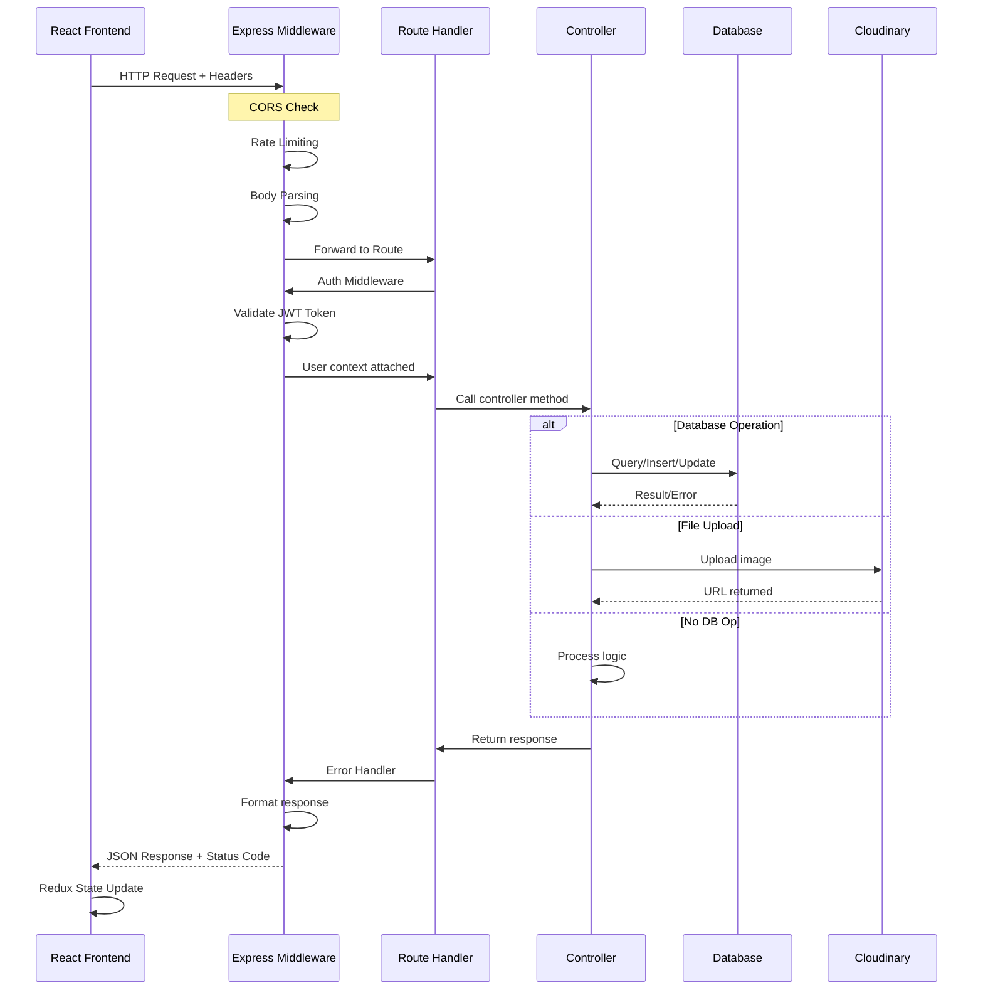
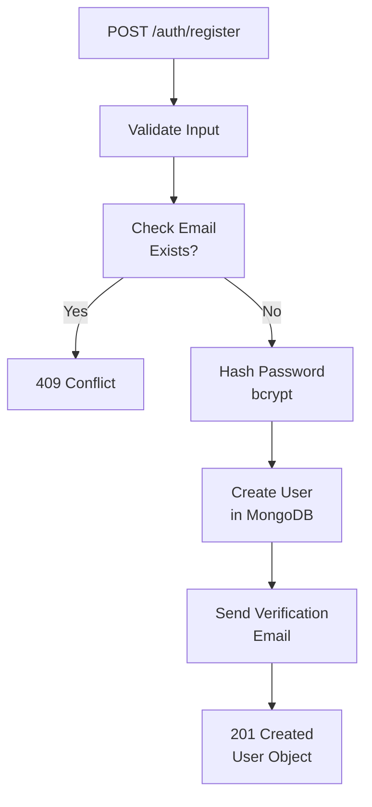
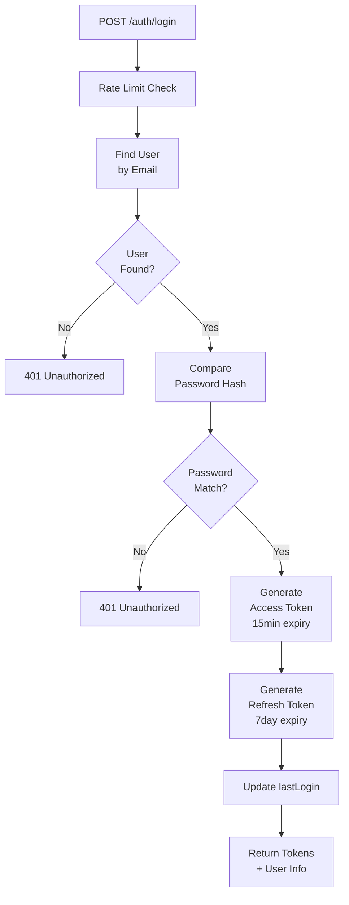
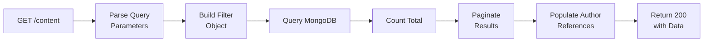
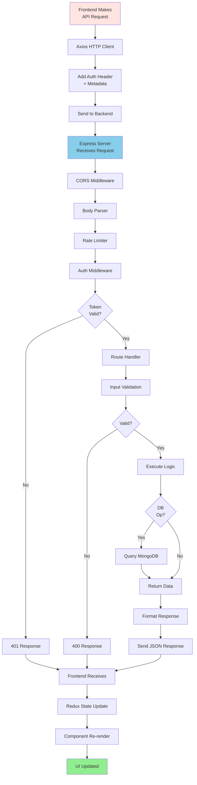

# API Documentation & Request/Response Lifecycle

## Overview

Agri-Connect API is built with **Express.js** and follows RESTful principles. This document outlines all endpoints, request/response formats, and their complete lifecycle.

---

## API Base Configuration

```
Development:  http://localhost:5000
Staging:      https://api-staging.agri-connect.com
Production:   https://api.agri-connect.com

All endpoints return JSON
Authentication: Bearer JWT tokens in Authorization header
```

---

## Request/Response Lifecycle Diagram



---

## Authentication Endpoints

### POST /auth/register

Register a new user account.

**Request:**
```json
{
  "email": "farmer@example.com",
  "password": "SecurePass123!",
  "fullName": "John Farmer",
  "role": "farmer",
  "state": "Punjab",
  "district": "Ludhiana"
}
```

**Response (201):**
```json
{
  "success": true,
  "message": "User registered successfully",
  "user": {
    "_id": "507f1f77bcf86cd799439011",
    "email": "farmer@example.com",
    "fullName": "John Farmer",
    "role": "farmer",
    "isVerified": false
  }
}
```

**Flow:**


---

### POST /auth/login

Authenticate user and get tokens.

**Request:**
```json
{
  "email": "farmer@example.com",
  "password": "SecurePass123!"
}
```

**Response (200):**
```json
{
  "success": true,
  "message": "Login successful",
  "accessToken": "eyJhbGciOiJIUzI1NiIsInR5cCI6IkpXVCJ9...",
  "refreshToken": "eyJhbGciOiJIUzI1NiIsInR5cCI6IkpXVCJ9...",
  "user": {
    "_id": "507f1f77bcf86cd799439011",
    "email": "farmer@example.com",
    "fullName": "John Farmer",
    "role": "farmer",
    "lastLogin": "2026-06-19T10:30:00Z"
  }
}
```

**Auth Flow:**


---

### POST /auth/refresh

Refresh expired access token using refresh token.

**Request:**
```json
{
  "refreshToken": "eyJhbGciOiJIUzI1NiIsInR5cCI6IkpXVCJ9..."
}
```

**Response (200):**
```json
{
  "success": true,
  "accessToken": "eyJhbGciOiJIUzI1NiIsInR5cCI6IkpXVCJ9..."
}
```

---

## Content Endpoints

### GET /content

Get paginated content list with filters.

**Query Parameters:**
```
?category=crop&page=1&limit=10&sort=-createdAt
```

**Response (200):**
```json
{
  "success": true,
  "data": [
    {
      "_id": "507f1f77bcf86cd799439011",
      "title": "Best Crop Rotation Practices",
      "description": "Learn optimal crop rotation...",
      "thumbnail": "https://res.cloudinary.com/...",
      "author": {
        "_id": "507f1f77bcf86cd799439012",
        "fullName": "Dr. Expert"
      },
      "category": "crop",
      "views": 245,
      "likes": 32,
      "status": "published",
      "createdAt": "2026-06-15T10:00:00Z"
    }
  ],
  "pagination": {
    "page": 1,
    "limit": 10,
    "total": 150,
    "pages": 15
  }
}
```

**Request Flow:**


---

### POST /content

Create new content (requires auth, expert/admin role).

**Headers:**
```
Authorization: Bearer <accessToken>
Content-Type: application/json
```

**Request:**
```json
{
  "title": "Organic Farming Guide",
  "description": "Complete guide to organic farming",
  "content": "<h1>Introduction</h1><p>...</p>",
  "category": "crop",
  "tags": ["organic", "sustainability"],
  "thumbnail": "https://res.cloudinary.com/..."
}
```

**Response (201):**
```json
{
  "success": true,
  "message": "Content created successfully",
  "data": {
    "_id": "507f1f77bcf86cd799439013",
    "title": "Organic Farming Guide",
    "author": "507f1f77bcf86cd799439011",
    "status": "draft",
    "createdAt": "2026-06-19T12:00:00Z"
  }
}
```

---

### GET /content/:id

Get single content with full details and comments.

**Response (200):**
```json
{
  "success": true,
  "data": {
    "_id": "507f1f77bcf86cd799439011",
    "title": "Best Crop Rotation Practices",
    "content": "<h1>Title</h1>...",
    "author": {
      "_id": "507f1f77bcf86cd799439012",
      "fullName": "Dr. Expert",
      "role": "expert"
    },
    "views": 245,
    "likes": 32,
    "comments": [
      {
        "_id": "507f1f77bcf86cd799439014",
        "user": {
          "fullName": "John Farmer"
        },
        "text": "Very helpful!",
        "createdAt": "2026-06-18T08:00:00Z"
      }
    ],
    "savedBy": ["507f1f77bcf86cd799439015"],
    "status": "published"
  }
}
```

---

### PATCH /content/:id

Update content (requires auth, author/admin).

**Request:**
```json
{
  "title": "Updated Title",
  "content": "<h1>New Content</h1>",
  "tags": ["tag1", "tag2"]
}
```

**Response (200):**
```json
{
  "success": true,
  "message": "Content updated successfully",
  "data": { ... }
}
```

---

## Community Q&A Endpoints

### GET /community/questions

Get all questions with pagination and filters.

**Query Parameters:**
```
?category=crop&status=open&sort=-createdAt&page=1&limit=20
```

**Response (200):**
```json
{
  "success": true,
  "data": [
    {
      "_id": "507f1f77bcf86cd799439020",
      "title": "What is the best time to plant wheat?",
      "author": {
        "_id": "507f1f77bcf86cd799439011",
        "fullName": "John Farmer"
      },
      "category": "crop",
      "views": 125,
      "answerCount": 3,
      "status": "answered",
      "createdAt": "2026-06-10T14:00:00Z"
    }
  ],
  "pagination": { ... }
}
```

---

### POST /community/questions

Create new question (requires auth).

**Request:**
```json
{
  "title": "How to prevent crop disease?",
  "content": "I have noticed some yellowing on leaves...",
  "category": "crop",
  "tags": ["disease-prevention", "pest-control"]
}
```

**Response (201):**
```json
{
  "success": true,
  "message": "Question posted successfully",
  "data": {
    "_id": "507f1f77bcf86cd799439021",
    "title": "How to prevent crop disease?",
    "author": "507f1f77bcf86cd799439011",
    "status": "open"
  }
}
```

---

### POST /community/questions/:id/answers

Add answer to question.

**Request:**
```json
{
  "content": "Here are the steps to prevent crop disease..."
}
```

**Response (201):**
```json
{
  "success": true,
  "message": "Answer posted successfully",
  "data": {
    "_id": "507f1f77bcf86cd799439022",
    "author": "507f1f77bcf86cd799439012",
    "content": "Here are the steps...",
    "createdAt": "2026-06-19T09:00:00Z"
  }
}
```

---

### PATCH /community/questions/:id/answers/:answerId/accept

Accept an answer as solution.

**Response (200):**
```json
{
  "success": true,
  "message": "Answer marked as accepted",
  "data": {
    "questionId": "507f1f77bcf86cd799439020",
    "answerId": "507f1f77bcf86cd799439022",
    "isAccepted": true
  }
}
```

---

## Search Endpoints

### GET /search

Full-text search across content and questions.

**Query Parameters:**
```
?q=crop+rotation&type=all&page=1&limit=20
```

**Response (200):**
```json
{
  "success": true,
  "results": {
    "content": [
      {
        "_id": "507f1f77bcf86cd799439011",
        "title": "Best Crop Rotation Practices",
        "description": "...",
        "type": "content"
      }
    ],
    "questions": [
      {
        "_id": "507f1f77bcf86cd799439020",
        "title": "What is crop rotation?",
        "type": "question"
      }
    ]
  },
  "totalResults": 45
}
```

---

## User Endpoints

### GET /users/me

Get current authenticated user profile.

**Headers:**
```
Authorization: Bearer <accessToken>
```

**Response (200):**
```json
{
  "success": true,
  "data": {
    "_id": "507f1f77bcf86cd799439011",
    "email": "farmer@example.com",
    "fullName": "John Farmer",
    "role": "farmer",
    "state": "Punjab",
    "district": "Ludhiana",
    "preferences": {
      "language": "en",
      "contentTopics": ["crop", "weather"],
      "notifications": true
    },
    "createdAt": "2026-01-15T10:00:00Z"
  }
}
```

---

### PATCH /users/me

Update user profile.

**Request:**
```json
{
  "fullName": "John Farmer Updated",
  "preferences": {
    "contentTopics": ["crop", "livestock"],
    "notifications": false
  }
}
```

**Response (200):**
```json
{
  "success": true,
  "message": "Profile updated successfully",
  "data": { ... }
}
```

---

## Error Handling

### Error Response Format

```json
{
  "success": false,
  "message": "Error description",
  "error": {
    "code": "VALIDATION_ERROR",
    "details": [
      {
        "field": "email",
        "message": "Invalid email format"
      }
    ]
  }
}
```

### Common HTTP Status Codes

| Code | Meaning | Example |
|------|---------|---------|
| **200** | OK | Successful GET/PATCH request |
| **201** | Created | Successful POST request |
| **400** | Bad Request | Invalid input data |
| **401** | Unauthorized | Missing/invalid JWT token |
| **403** | Forbidden | Insufficient permissions |
| **404** | Not Found | Resource doesn't exist |
| **409** | Conflict | Email already exists |
| **429** | Too Many Requests | Rate limit exceeded |
| **500** | Server Error | Unexpected server error |

### Error Response Examples

**400 - Validation Error:**
```json
{
  "success": false,
  "message": "Validation failed",
  "error": {
    "code": "VALIDATION_ERROR",
    "details": [
      { "field": "email", "message": "Invalid email format" },
      { "field": "password", "message": "Password must be at least 8 characters" }
    ]
  }
}
```

**401 - Unauthorized:**
```json
{
  "success": false,
  "message": "No token provided",
  "error": {
    "code": "NO_AUTH_TOKEN"
  }
}
```

**409 - Conflict:**
```json
{
  "success": false,
  "message": "Email already registered",
  "error": {
    "code": "EMAIL_EXISTS"
  }
}
```

---

## Rate Limiting

All endpoints are subject to rate limiting:

```
Global Rate Limit:   200 requests per 15 minutes per IP
Auth Rate Limit:     5 requests per 15 minutes per IP (login/register)
Search Rate Limit:   100 requests per 15 minutes per IP
```

Rate limit headers returned:
```
X-RateLimit-Limit:       200
X-RateLimit-Remaining:   187
X-RateLimit-Reset:       1234567890
```

---

## Pagination

All list endpoints support pagination:

```
?page=1&limit=10&sort=-createdAt
```

Response includes:
```json
{
  "pagination": {
    "page": 1,
    "limit": 10,
    "total": 156,
    "pages": 16
  }
}
```

---

## Complete API Lifecycle Diagram



---

*API documentation created for development and integration reference.*
*Last updated: 2026-06-19*
