# Frontend Architecture & Component Lifecycle

## Overview

Agri-Connect frontend is built with **React 18** + **Redux Toolkit** for state management and **Tailwind CSS** for styling. This document outlines the component architecture, data flow, and lifecycle.

---

## Application Startup Lifecycle

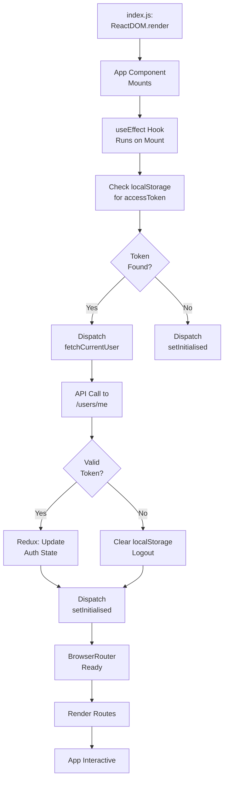

---

## Component Architecture

### Directory Structure and Component Hierarchy

```
src/components/
├── shared/                    (Reusable across app)
│   ├── Navbar.jsx            (Top navigation)
│   ├── OfflineBanner.jsx      (Offline indicator)
│   ├── ProtectedRoute.jsx     (Route protection)
│   └── ContentCard.jsx        (Reusable card)
│
├── auth/                      (Authentication)
│   ├── ProfilePage.jsx        (User profile)
│   └── (LoginPage in pages/)
│
├── dashboard/                 (Dashboard feature)
│   └── Dashboard.jsx
│
├── content/                   (Content management)
│   ├── ArticleViewer.jsx      (View articles)
│   ├── CreateContent.jsx      (Create articles)
│   └── SavedPage.jsx          (Saved articles)
│
├── community/                 (Community Q&A)
│   ├── CommunityPage.jsx      (Q&A list)
│   └── QuestionDetail.jsx     (Single question)
│
├── search/                    (Search feature)
│   └── SearchPage.jsx
│
└── admin/                     (Admin features)
    └── AdminDashboard.jsx
```

### Component Tree

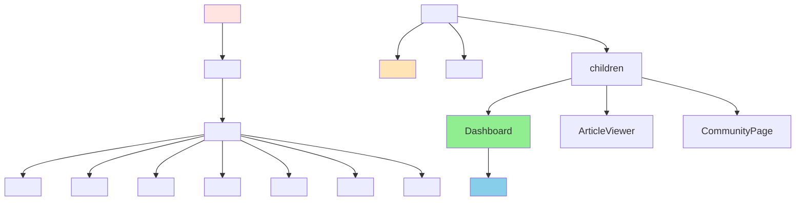

---

## Redux State Management

### Redux Store Structure

```javascript
store = {
  auth: {
    user: {
      _id: string,
      email: string,
      fullName: string,
      role: string,
      preferences: object
    },
    accessToken: string,
    refreshToken: string,
    isAuthenticated: boolean,
    isInitialised: boolean,
    loading: boolean,
    error: string | null
  },
  
  content: {
    items: [
      {
        _id: string,
        title: string,
        description: string,
        author: object,
        category: string,
        views: number,
        likes: number,
        savedBy: [string],
        status: string
      }
    ],
    selectedContent: object | null,
    filters: {
      category: string,
      search: string,
      sort: string
    },
    pagination: {
      page: number,
      limit: number,
      total: number
    },
    loading: boolean,
    error: string | null
  }
}
```

### Redux Data Flow

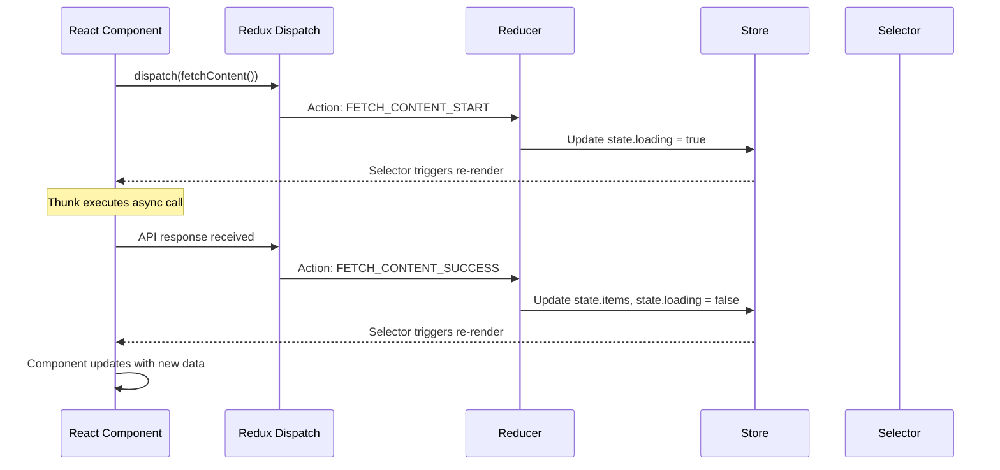

---

## Redux Slices

### authSlice

```javascript
// State
{
  user: null,
  accessToken: null,
  refreshToken: null,
  isAuthenticated: false,
  isInitialised: false,
  loading: false,
  error: null
}

// Async Thunks
fetchCurrentUser()           // GET /users/me
loginUser(email, password)   // POST /auth/login
registerUser(data)           // POST /auth/register
logoutUser()                 // Clear state

// Synchronous Actions
setInitialised()
updateUser(userData)
clearError()
```

### contentSlice

```javascript
// State
{
  items: [],
  selectedContent: null,
  filters: {
    category: 'all',
    search: '',
    sort: '-createdAt'
  },
  pagination: {
    page: 1,
    limit: 10,
    total: 0
  },
  loading: false,
  error: null
}

// Async Thunks
fetchContent(filters)        // GET /content
fetchSingleContent(id)       // GET /content/:id
createContent(data)          // POST /content
updateContent(id, data)      // PATCH /content/:id
saveContent(contentId)       // POST /content/:id/save

// Synchronous Actions
setFilters(filters)
setPagination(pagination)
clearError()
```

---

## Component Lifecycle Patterns

### Page Component Lifecycle Example (Dashboard)

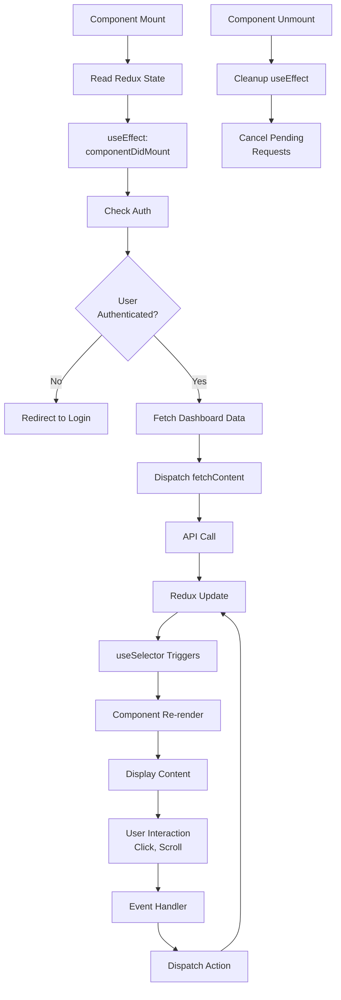

### Card Component Lifecycle Example (ContentCard)

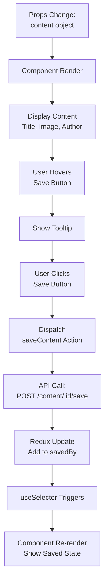

---

## Data Flow: User Login Example

Complete flow from user interaction to UI update:

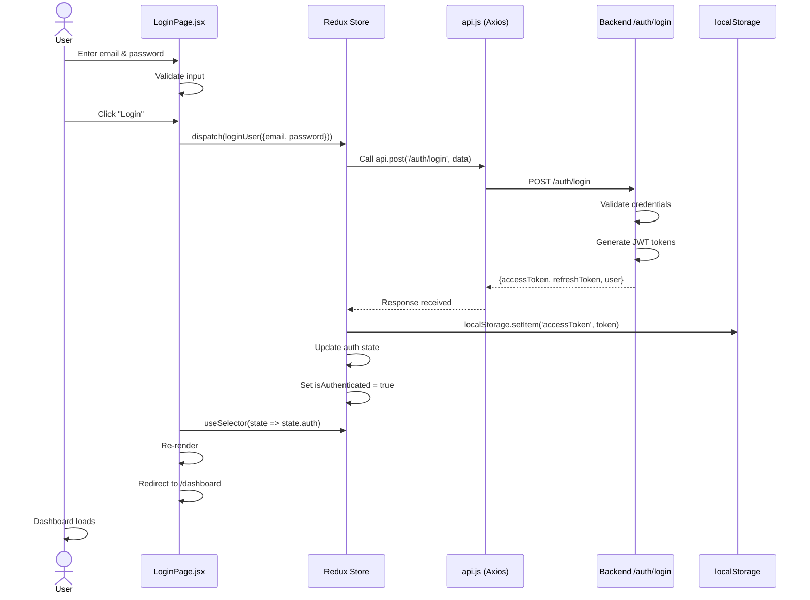

---

## Offline Functionality

### Offline Queue Lifecycle

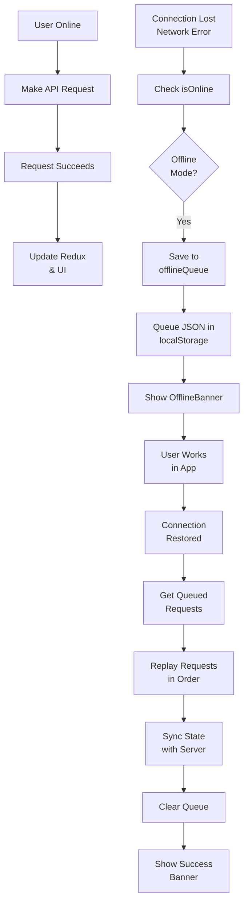

### Service Worker Offline Caching

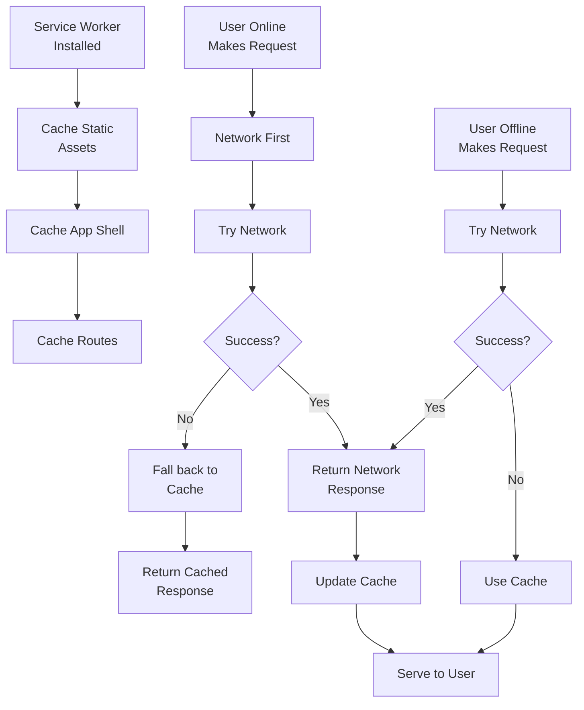

---

## Protected Route Component Lifecycle

```mermaid
graph TD
    A["ProtectedRoute<br/>Render"] --> B["Get Auth State<br/>from Redux"]
    B --> C{"User<br/>Authenticated?"}
    
    C -->|No| D{"isInitialised?"}
    D -->|No| E["Show Loading"]
    E --> F["Wait for Auth<br/>Check"]
    F --> C
    
    D -->|Yes| G["Redirect to<br/>Login"]
    
    C -->|Yes| H["Check User<br/>Role"}
    H --> I{"Role<br/>Allowed?"}
    
    I -->|No| J["Show Forbidden<br/>403"]
    I -->|Yes| K["Render<br/>Protected Component"]
```

---

## Hooks Overview

### useOfflineStatus Hook

```javascript
// Custom hook for offline detection
const isOnline = useOfflineStatus();

// Monitors:
// - window.navigator.onLine
// - 'online' / 'offline' events
// - Periodic heartbeat to backend

// Returns: boolean (true = online, false = offline)
```

**Hook Lifecycle:**
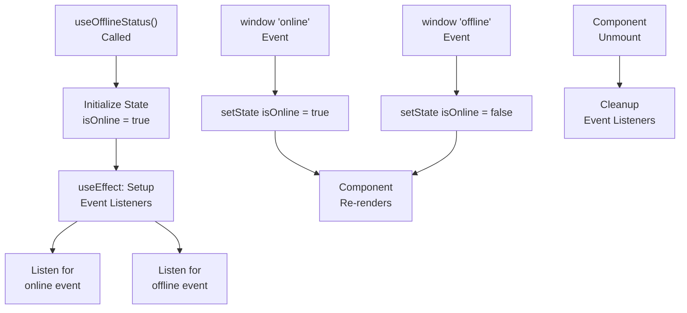

---

## Component Communication Patterns

### Parent → Child (Props Drilling)
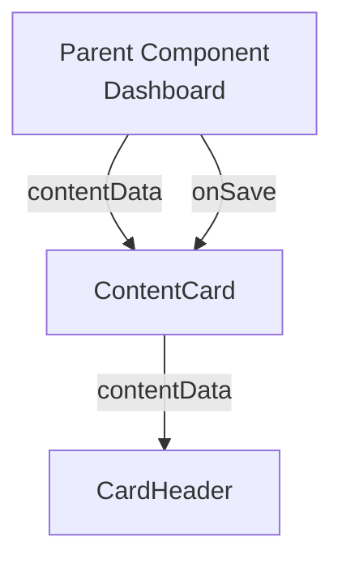

### Child → Parent (Callbacks)
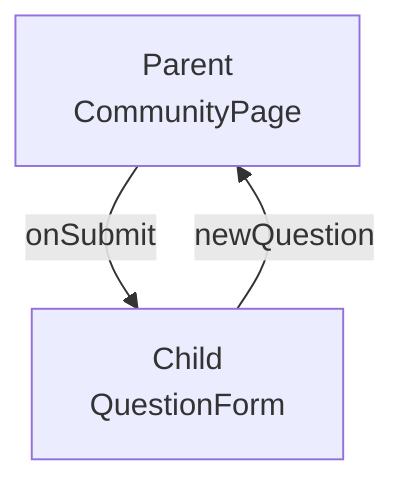

### Global State (Redux)
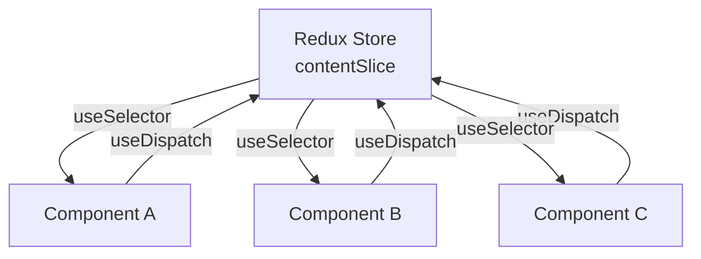

---

## Performance Optimization

### Code Splitting Strategy

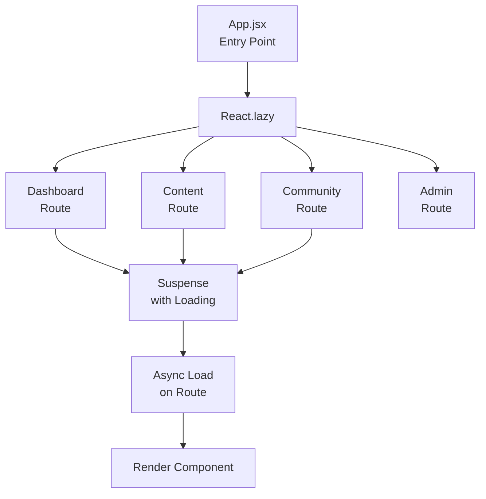

### Selector Memoization

```javascript
// Avoid re-renders from unrelated state changes
const selectUserPreferences = (state) => state.auth.user.preferences;

// In component:
const preferences = useSelector(selectUserPreferences);
// Component only re-renders when preferences change
```

---

## Error Boundaries

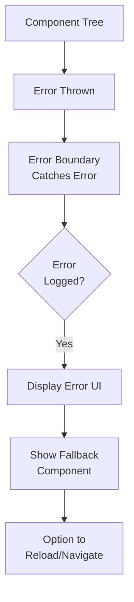

---

## Complete User Journey

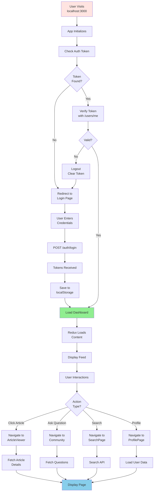

---

## Testing Component Lifecycle

### Common Testing Scenarios

```javascript
// Test component mounting and initial state
describe('Dashboard Component', () => {
  test('renders loading state on mount', () => {
    const { getByText } = render(<Dashboard />);
    expect(getByText('Loading...')).toBeInTheDocument();
  });

  test('displays content after API call', async () => {
    const { getByText } = render(<Dashboard />);
    await waitFor(() => {
      expect(getByText('Article Title')).toBeInTheDocument();
    });
  });

  test('handles API errors gracefully', async () => {
    // Mock API error
    const { getByText } = render(<Dashboard />);
    await waitFor(() => {
      expect(getByText('Error loading content')).toBeInTheDocument();
    });
  });

  test('redirects unauthenticated users', () => {
    const { navigate } = renderWithRouter(<ProtectedRoute><Dashboard /></ProtectedRoute>);
    expect(navigate).toHaveBeenCalledWith('/login');
  });
});
```

---

*Frontend documentation created for development and research reference.*
*Last updated: 2026-06-19*
